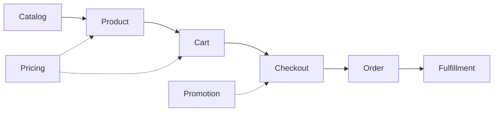

# Shop Engine — Library Specification (draft)

> Working title: **shop-engine** (name TBD). Status: draft spec, iterated alongside the
> Empires shop refactoring. Curated by Nayte (PO) — this document records the target,
> not the current state of any code.

## 1. Thesis

Every ordering system — an e-commerce site, a fast-food kiosk, a board-game shop, a B2B
procurement flow — follows the same canonical pattern:



Existing PHP solutions ship this pattern **welded to a commerce context**: Sylius assumes a
storefront (taxes, shipping, channels, admin), Thelia is a full CMS (own kernel, Propel,
MySQL schema), Aimeos embeds its own schema, DB layer and admin — an embeddable shop, not
a domain engine.

An extractable core is not a new idea, and its track record is the real argument. Sylius
did split its domain into standalone, UI-free components (`Sylius\Component\Order`;
`Sylius/Cart` still calls itself *"Webshop cart library for PHP"*), keeping framework glue
in Bundles and templates in a separate ShopBundle — and almost nobody consumed them
outside Sylius, so 2.0 dropped pieces without deprecation. In JS, Medusa v2 ships
decoupled commerce modules, each installable on its own, but every module owns its data
model and migrations: persistence is prescribed, not delegated. What is still missing in
PHP is an ordering core that assumes no commerce context **and** treats persistence itself
as a port — a minimal library that implements the pattern and lets the host application
decide everything contextual.

**shop-engine is that engine.** It models the ordering domain and nothing else. Every
contextual decision — how the cart is persisted, where products come from, who may
confirm an order, whether payment even exists — is a **port** the host implements (or a
shipped reference adapter it picks).

The founding insight, validated on a real project (Empires, a Mega Civilization
adaptation): a shop with no payment processing, no stock, no shipping and no taxes is
still, structurally, a shop. An order-taking system is the invariant core; commerce is
one possible context.

## 2. Design principles

1. **Minimal core, canonical vocabulary.** Types are named after the pattern
   (`Catalog`, `Product`, `Cart`, `Order`, `OrderLine`, `Promotion`) so any developer
   who has seen a shop understands the API in minutes. No invented jargon — and the
   vocabulary is not ours to invent: `Catalog → Product → Cart → Checkout → Order →
   Fulfillment` is the standard decomposition of an **Order Management System**,
   settled long before us by the retail (ARTS/NRF data model) and telecom (TM Forum
   SID) reference models, by Fowler's order and pricing patterns (*Analysis Patterns*,
   *PoEAA*), and implemented as a reusable order-management component in Apache OFBiz
   for over twenty years. Naming along that line is an adoption argument, not an
   aesthetic one: an integrator recognises the surface before reading it, and every
   deviation from it is a word we would have to teach. See §11 for the full survey.
2. **Ports over features.** When a capability depends on context, the core defines an
   interface and ships nothing (or a trivial default). Reference adapters live in
   separate packages (`shop-engine/adapter-*`).
3. **Symfony components underneath, no framework required.** The core depends on
   standalone components only (see §6) and runs in any PHP app; a Symfony bundle is an
   *adapter*, not the core.
4. **CQRS-shaped write side.** Every domain mutation is an explicit command object with
   a handler. The read side is unconstrained.
5. **Data shapes are stable; statuses transition.** An `OrderLine` has the same shape
   whether the order is a draft, pending, or confirmed. The *authority* of a value
   (quoted vs frozen price) is carried by the order status, never by a change of shape.
6. **Nothing speculative.** The core ships the smallest surface that supports the known
   use cases (§8). Anything else is an extension point.

## 3. Domain model (core)

### Product & Catalog (read side)

- `ProductInterface` — **delivered**, minimal by PO decision: identity (`key`) plus
  the inputs pricing/promotion need — `cost` (int), `facets` (`list<string>`),
  `credits` (`array<string, int>`), `promotion` (`?ProductPromotion`). Deliberately
  **no display fields** (name, image, description): the library never renders
  anything, so it never needs them — the host rebuilds display rows from its own
  catalog (in Empires: `App\Rules\Ruleset\Advance` implements it directly, zero
  accessors). The library never persists products.
- `ProductProviderInterface` (**port**) — **delivered**: `products()` and
  `productsByKeys(list<string> $keys)`, both returning `list<ProductInterface>`.
  Ordering is the provider's responsibility — callers must not re-sort. Adapters:
  Doctrine repository, config file (YAML/JSON), remote API, in-memory (in Empires:
  `App\Rules\Shop\AdvanceProductProvider`, wrapping `AdvanceCatalog`).
- `CatalogInterface` — the *per-buyer* view of the products: the provider's output
  filtered by eligibility rules. Target, not yet built.
- `ProductEligibilityInterface` (**port**, chainable) — decides whether a buyer may see
  or buy a product. Reference rules: `NotAlreadyOwned`, `PrerequisitesMet`,
  `MaxQuantityPerBuyer`, `SegmentFilter` (e.g. region). Real-world source: game rules
  (one copy per player, tech prerequisites, region-restricted catalogs) map 1:1 to
  B2C rules (one per customer, bundle requirements, market segmentation). Target, not
  yet built.

### Buyer

- `BuyerInterface` — **delivered**: identity (`id`) plus the attributes pricing needs
  (`ownedKeys`, `electiveCredits`). The library never owns users; the host maps its
  User/Player/Customer entity onto this interface (in Empires:
  `App\Rules\Shop\PlayerBuyer`, built by `ShopConnector::buyerFor()`). This is the
  primary connector to the host's world.
- `BuyerProviderInterface` (**port**) — **delivered**: `buyerFor(Uuid $buyerId):
  BuyerInterface`, resolving a buyer id into a `BuyerInterface` without any library
  caller touching the host's repository directly. Adapter: `App\Infrastructure\Shop\PlayerBuyerProvider`,
  composing `PlayerRepository` + `ShopConnector::buyerFor()`. It absorbed the four
  `PlayerRepository::find() ?? throw` sites that used to sit in the `CommandHandler`s
  and `OrderValidator`.

### Cart

- `Cart` — a **pure value object**: an ordered set of line intents (`key`, `quantity`).
  Operations: `add`, `remove`, `clear`, `has`, `isEmpty`, `fromKeys`. No storage, no
  services, no events. It is a *draft order* and nothing more.
- `CartStorageInterface` (**port**) — **delivered**: `load(string $key): Cart`,
  `save(string $key, Cart)`, `clear(string $key)`. The key is an **opaque storage key,
  not a buyer id** — an earlier draft of this document said `buyerId` and was wrong: a
  single buyer may hold several carts under distinct keys, as the point-of-sale path
  proves (an operator keeps a cart on behalf of a buyer, under `pos.<uuid>`). Typing the
  key to a buyer identity would have made mediated checkout unrepresentable.
  **This is the flagship example of the whole philosophy** — the same
  Cart serves radically different contexts purely by swapping storage:
    - `SessionCartStorage` — classic web session (default web adapter);
    - **client-held** — no storage at all: the UI layer holds the keys (hardware kiosk,
      Live Component prop, SPA state) and rebuilds `Cart::fromKeys()` per interaction;
      the library must work perfectly with a cart that only ever exists per-request;
    - `DoctrineCartStorage` — persistent carts (abandoned-cart recovery, cross-device);
    - `InMemoryCartStorage` — tests.

### Order & OrderLine

- `OrderLine` — immutable VO: `key`, `unitPrice`, `quantity` (+ extension slot for
  applied promotions, see §5). Same shape at every status. A line's price starts as a
  **quote** (snapshot at submission) and becomes **authoritative** when the order
  reaches a confirmed status.
- `OrderInterface` — **delivered**, minimal by the same "nothing speculative"
  discipline as `ProductInterface`: buyer ref (`buyerId`), `window`, `status`,
  `lines()`, `keys()`, `replaceLines()`, `freeze()`, plus `getMarking()`/`setMarking()`
  for the workflow marking store (the `shop_order` state machine needs them on any
  implementation, even though no other library code calls them directly). `id`,
  `total`, `validatedAt`, `createdAt` are deliberately off the interface — verified
  unread by any library code; they ship when a caller actually needs them, not
  before. The host persists it (in Empires: a Doctrine entity, with the lines as an
  embedded JSON document by default — a dedicated line table is the host's choice).
- **Status machine** — powered by `symfony/workflow`. Core default is deliberately
  tiny: `draft → pending → confirmed` + `cancelled` from any non-final state. Hosts
  extend the definition (paid, shipped, refunded…) without touching the engine; guards
  are workflow guards.
- `OrderRepositoryInterface` (**port**) — **delivered**: `findOneByBuyerAndWindow()`,
  `create()`, `remove()` — the latter two only schedule the write in the current unit
  of work, not durable until the enclosing transactional scope commits. Adapter:
  `App\Infrastructure\Repository\OrderRepository`; `create()` uses `getReference()`, so it needs no
  `PlayerRepository` of its own.
- `OrderNumberInterface` (**port**) — identity scheme is contextual (sequential
  invoice numbers vs UUIDs vs `(buyer, window)` uniqueness — all valid). Target, not
  yet built: Empires relies on `(buyer, window)` uniqueness directly, with no number
  generator.

**Portability status (code vs config) — resolved.** The lib's `src/` *code* names no
host class — every host entity, repository and
`EntityManagerInterface` reference that used to sit in a `CommandHandler` or
`OrderValidator` is gone, replaced by `OrderInterface`, `OrderRepositoryInterface`,
`BuyerProviderInterface`, `TransactionInterface`. Its *config* no longer does either:
`config/workflow.yaml` ships with no `supports:` key at all — `UserforgedShopEngineBundle`
builds it from the host-supplied `userforged_shop_engine.order_class` configuration
(`prependExtension()`, since `framework.workflows` must be prepended before
FrameworkBundle processes it). Putting `getMarking()`/`setMarking()` on `OrderInterface`,
rather than leaving them off, is what made that fix a config change instead of a
redesign: any class implementing `OrderInterface` already satisfies the marking-store
contract the state machine needs, whatever its FQCN.

### Checkout (write side, CQRS)

Commands (final classes, validated by `symfony/validator`) and their handlers:

- `SubmitOrder { buyerId, lines, context }` — cart → pending order. The command
  receives its full payload; **handlers never read ambient state** (no session access
  from the domain — a lesson written in blood).
- `ConfirmOrder { orderId }` — freeze prices, fire fulfillment. Who may dispatch it is
  the host's concern: the buyer (self-checkout) or an operator (mediated checkout —
  POS, B2B approval). **Both are first-class**; the engine has no opinion.
- `CancelOrder { orderId, reason }` — explicit rejection with trace.
- `DirectSale { buyerId, lines, context }` — submit + confirm in one transaction (POS
  pattern).

Handlers are plain invokable services usable directly or through `symfony/messenger`
(sync or async — host's choice; the library does not require a bus).

- `TransactionInterface` (**port**) — **delivered**: `transactional(callable $unit):
  void` and `afterCommit(callable $hook): void`. Re-entrant by design: a nested
  `transactional()` call joins the enclosing scope instead of opening a real nested
  transaction — the mechanism that lets `SellDirectHandler` ride its mutations into
  `OrderValidator::validate()`'s single scope through the unit of work, rather than
  opening a scope of its own (opening one there would put the eligibility check and
  `quote()` — both of which throw — inside an open transaction, and Doctrine closes
  the `EntityManager` on any throwable). Adapter: `Userforged\ShopEngine\Doctrine\DoctrineTransaction`.

### Fulfillment

- `FulfillmentInterface` (**port**) — what "delivering" means: granting a license,
  adding a game advance to a player, decrementing stock and printing a label, or
  nothing. Called on confirmation; must be reversible (`revoke`) to support
  cancellation of confirmed orders.

## 4. Pricing

- `PriceResolverInterface` (**port**) — `resolve(Product, Buyer): int`. Default: the
  product's base price. This is where *customer-specific pricing* plugs in (loyalty
  prices, owned-product credits, negotiated B2B rates).
- Invariants the engine enforces: prices are integers, floored at zero (a promotion
  can make a product free, never negative), line price × quantity = line total,
  order total = Σ line totals unless an order-level adjustment says otherwise.

## 5. Promotion engine

Rule → action, evaluated at cart display and re-evaluated (authoritatively) at
confirmation. Both sides are ports; the core ships the composition logic and a
reference action set distilled from real catalogs (96 products of a live game +
classic commerce):

| Action | Canonical name | Example |
|---|---|---|
| `Gift` | gift with purchase | "buying X grants one product of category C under price P for free" |
| `LineDiscount` | buy X get Y discount | "40 off one other line in the same order" |
| `ElectiveBenefit` | elective benefit (selectable earning rule) | "at purchase, the buyer allocates a standing pricing advantage" — the choice is persisted with the line (see below) |
| `PriceModifier` | customer-specific price | permanent reductions derived from owned products |

Rules (`RuleInterface`): order composition, buyer attributes, product category,
custom. Actions record themselves on the `OrderLine` extension slot — an order must
be able to explain its own total forever.

### Elective benefits (earn-only)

Real-world family: "choose your 5% cashback category" credit cards, "pick your
favorite brands" grocery programs — a purchase grants a **standing pricing
advantage whose shape the buyer configures at purchase time**.

**Earn-only, never burn.** Elective benefits are NOT loyalty points: points are a
currency (accumulated, then *spent* and decremented). Benefits apply to every
future eligible purchase, forever, and are never consumed. They live on the
*pricing* side (they feed `PriceResolverInterface` as buyer attributes aggregated
from confirmed order lines). A spendable balance would belong to the *payment*
extension instead — the earn/burn distinction is the boundary between the two.

**Facets are a port.** `FacetProviderInterface` (**port**) — **delivered**:
`facets(): list<string>`. The engine never knows what the allocation facets *are*
(product categories, brands, departments, game colors…): the host connector
supplies the facet list (in Empires: `App\Rules\Shop\ShopConnector::facets()`,
mapping `App\Rules\Ruleset\Category` cases), the engine validates **structurally** against
the benefit's configuration, the host's price resolver interprets the stored
allocations. `LineQuoter` takes it as a constructor dependency — the change that let
`quote()`/`quotePreview()` drop their `$facets` parameter (six call sites
simplified). Storing the choice on the order line keeps two invariants for free:
the order explains itself forever, and cancelling the order revokes the benefit.

**The shape of the choice is data, not code.** Configuration examples, both served
by the same engine and both observed in a real catalog:

```yaml
# free allocation: "distribute a budget across facets, in fixed steps"
benefit:
    budget: 20
    step: 5

# exclusive picks: "exactly N distinct facets at a fixed value each,
# with a conditional penalty on the facet left out"
benefit:
    pick: 4
    value: 10
    forfeit: 10   # applied to the remaining facet only if the buyer
                  # holds at least that much in previously earned benefits
```

The picker UI derives from the configuration (`budget`+`step` → a ±step
allocator; `pick` → "choose the excluded facet", a single interaction). A
`forfeit` may produce a *negative* entry in the stored allocation; aggregation is
a plain sum, so reversal and self-explanation still hold.

Out of core, possible as adapters: coupons/codes, time-boxed campaigns, cart-level
percentage discounts.

## 6. Symfony components used (and why)

| Component | Role | Required? |
|---|---|---|
| `symfony/workflow` | order status machine | yes |
| `symfony/validator` | command payload validation | yes |
| `symfony/uid` | identities | yes |
| `symfony/clock` | testable time (quotes, timestamps) | yes |
| `psr/event-dispatcher` | domain events — framework-agnostic path, for consumers without Messenger | **optional** — see §10 (Domain events) |
| `symfony/messenger` | command bus + dedicated event bus (`shop.event.bus`) — Symfony-native path, for both commands and domain events | **optional** — handlers are plain services either way |
| Doctrine ORM | order/cart persistence | **optional adapter** |
| Symfony bundle (DI config, session storage) | framework glue | **optional adapter** |

No Twig, no forms, no HTTP anything in core: the engine renders nothing.

`doctrine/dbal` and `doctrine/orm` are genuine, standing dependencies of the adapter
tier, not transitional debt — `OrderLinesType` (the `OrderLine[]` Doctrine type) and
`DoctrineTransaction` (the `TransactionInterface` adapter) both need them, and neither
is going away. `symfony/http-foundation` **is gone**: it was there solely because the
old `CartRepository` was hardcoded to the HTTP session, and it left the day
`CartStorageInterface` shipped (see §3, Cart). The session-backed adapter now lives in
the host, which is where a choice of storage belongs.

## 7. What the core will NOT contain (anti-scope)

Payment processing, taxes, shipping, stock/inventory, multi-currency, admin UI,
user management, emails. Each is either a host concern or a future adapter. A shop
where payment happens "at the counter" (click-and-collect, game treasury, cash) is
the *default* mental model — payment is an extension, not a hole.

## 8. Reference use cases (agnosticism proof)

Each case = same core, different ports:

1. **Classic web shop** — session cart, Doctrine products, self-checkout, payment
   adapter, stock-decrement fulfillment.
2. **Fast-food kiosk** — client-held cart (the terminal owns the draft), catalog from
   API, `DirectSale` at the counter, no buyer accounts.
3. **Board-game shop (Empires)** — config-file catalog, eligibility = game rules
   (owned/prereqs/region), per-turn order uniqueness, operator-mediated confirmation
   (POS), fulfillment = granting advances, payment out of model, promotion actions
   gift/discount/option.
4. **B2B procurement** — persistent DB cart, approval workflow (extended status
   machine), negotiated `PriceResolver`, no promotions.
5. **Restaurant click-and-collect** — session cart, time-slotted context on
   `SubmitOrder`, pay at pickup.

## 9. Open questions (for iteration)

- Quantities: Empires never needs them (`quantity` fixed at 1) — core keeps the field
  from day one, or additive later? Leaning: field present, default 1, engine logic
  quantity-aware from the start (retrofitting is worse).
- Cart line richness: keys only, or key+quantity+options? Leaning: mirror `OrderLine`
  minus price.
- The `context` bag on commands (turn number, time slot, table number…): free array vs
  typed extension point.
- Package layout: monorepo with `core` + `adapter-doctrine` + `adapter-symfony` +
  `adapter-session`, split on release (Symfony-style)?
- License (MIT?), namespace, name.

## 10. Domain events

### Pourquoi

La lib `shop-engine` doit pouvoir rester ignorante du code métier qui consomme ses commandes. Or brancher une réaction en fin de traitement (rafraîchir Mercure, écrire dans le flashbag, envoyer un mail…) demande un point d'extension : quelque chose qui se déclenche après qu'une commande a réussi, sans que la lib connaisse ses consommateurs.

### Deux mécanismes, pas un choix exclusif

On propose les deux chemins listés en §6, pour deux publics différents :

- **Bus Messenger dédié (`shop.event.bus`)** — le chemin natif pour un hôte Symfony. Ne coûte rien : Messenger est déjà une dépendance de la lib pour son architecture CQRS (bus de commandes). **Implémenté** (voir ci-dessous).
- **`psr/event-dispatcher`** — le chemin pour un consommateur véritablement extérieur à Symfony (pas de container Symfony, pas de Messenger). **Implémenté** (voir ci-dessous).

Question ouverte, à trancher plus tard une fois les deux en usage réel : est-ce que l'un finit par couvrir totalement l'autre (ex. un adapter PSR au-dessus du bus Messenger), ou est-ce que les deux valent la peine d'être maintenus en parallèle indéfiniment ? Pas de réponse pour l'instant.

### Deux canaux, un point d'entrée unique (implémenté)

Les deux canaux sont unifiés derrière `ShopEventPublisher`, une classe composée (Facade injectée, pas un trait ni une classe de base héritée) que chaque `CommandHandler` reçoit comme n'importe quelle autre dépendance :

```php
final readonly class ShopEventPublisher
{
    public function __construct(
        private EventDispatcherInterface $eventDispatcher,
        #[Autowire(service: 'shop.event.bus')]
        private MessageBusInterface $eventBus,
        private LoggerInterface $logger,
    ) {}

    public function publish(object $event): void
    {
        // dispatch sur les deux canaux, chacun isolé par son propre try/catch
    }
}
```

Le connecteur se branche par le canal de son choix, les deux reçoivent le même event :

```php
// Canal Messenger
#[AsMessageHandler(bus: 'shop.event.bus')]
final class OnOrderSold { public function __invoke(OrderSold $event): void { /* ... */ } }

// Canal PSR-14
#[AsEventListener]
final class OnOrderSoldSync { public function __invoke(OrderSold $event): void { /* ... */ } }
```

`publish()` isole chaque canal dans son propre try/catch et journalise l'exception plutôt que de la laisser remonter : dans les 4 `CommandHandler`, le dispatch a lieu **après** que l'état a été durablement persisté (flush/validate déjà passés). Un listener qui lève une exception ne doit pas transformer une commande réellement réussie en échec apparent pour l'appelant — d'où l'isolation + log, jamais un swallow silencieux.

### Mécanisme Messenger (implémenté)

Un second bus Messenger, dédié aux events métier, coexiste avec le bus de commandes :

```yaml
# config/packages/messenger.yaml
framework:
    messenger:
        default_bus: messenger.bus.default
        buses:
            messenger.bus.default: ~
            shop.event.bus:
                default_middleware:
                    allow_no_handlers: true   # aucun listener n'existe encore côté connecteur
```

Contrairement au bus de commandes (un seul handler autorisé par message), un bus d'events accepte N souscripteurs indépendants — c'est le rôle de `allow_no_handlers` que d'autoriser aussi zéro souscripteur, l'état actuel.

Chaque `CommandHandler` de `src/CommandHandler/`, plus `OrderValidator` (voir plus bas), dispatch, une fois son traitement effectivement réussi (jamais avant), un event immuable au payload scalaire (pas d'entité Doctrine — le rend sérialisable si le bus passe un jour en async) :

| Command / appelant                | Event             | Payload               | Condition d'émission                             |
|------------------------------------|-------------------|------------------------|---------------------------------------------------|
| `SubmitOrder`                      | `OrderSubmitted`  | `buyerId`, `window`   | toujours                                           |
| `RejectOrder`                      | `OrderRejected`   | `buyerId`, `window`   | toujours                                           |
| `SellDirect`                       | `OrderSold`       | `buyerId`, `window`   | toujours                                           |
| `EraseOrders`                      | `OrdersErased`    | `buyerId`, `windows`  | uniquement les fenêtres réellement supprimées      |
| `OrderValidator::validate()` (pas une commande) | `OrderValidated`  | `buyerId`, `window`   | toujours, après le retour de `wrapInTransaction()` |

`OrderValidator::validate()` est un cas à part : contrairement aux 4 command handlers, il est appelable directement, en dehors de toute commande — c'est le chemin de validation par les pairs, sans passer par `SellDirect`. Sans event dédié, ce chemin ne publierait rien ; d'où `OrderValidated`. Son émission a lieu **après le retour de `wrapInTransaction()`**, jamais à l'intérieur : les anciens `hub->publish(...)` y étaient, donc avant le flush et avant le commit — un event émis là pousserait un état pas encore durablement persisté.

Pour se brancher, le connecteur enregistre un handler sur ce bus :

```php
#[AsMessageHandler(bus: 'shop.event.bus')]
final class OnOrderSold
{
    public function __invoke(OrderSold $event): void { /* Mercure, mail, flashbag... */ }
}
```

### Alternatives écartées

- **Décorer le `CommandHandler`** — couple le connecteur à l'implémentation interne du handler (fragile si la lib change), et scale mal dès qu'on veut plusieurs listeners indépendants.
- **`WorkerMessageHandledEvent`** (event natif du `Worker` Messenger) — ne se déclenche que via `messenger:consume` sur un transport réellement async ; inopérant tant que nos commandes restent en `sync://`.

### Côté hôte : premier abonné (implémenté)

Le bus a maintenant un abonné réel : `App\Infrastructure\Mercure\ShopMercurePublisher`, enregistré sur `bus: 'shop.event.bus'` uniquement (jamais `#[AsEventListener]` en plus — les deux canaux publieraient en double, voir §"Deux canaux" plus haut). Il traduit les events granulaires de la lib vers les deux noms Mercure déjà consommés par le frontend (`order-updated`, `player-updated`) :

- `OrderSubmitted` → `order-updated`
- `OrderValidated` → `order-updated` puis `player-updated`
- `OrderRejected` → **non mappé**, faute de chemin à rafraîchir : cet hôte a supprimé toute sa chaîne de rejet (ni bouton, ni action, ni dispatch de `RejectOrder`), donc l'event n'est jamais émis ici. La capacité reste shippée et testée dans la lib (`RejectOrderHandler`, transition `reject`) ; un hôte qui la câble devra ajouter son propre handler — c'est un mapping à écrire, pas un mapping existant.
- `OrdersErased` → `player-updated` puis `order-updated`
- `OrderSold` → volontairement non mappé : `SellDirect` valide en appelant `OrderValidator::validate()` en interne, qui a déjà publié `OrderValidated` pour la même mutation ; mapper `OrderSold` aussi publierait en double.

**Ce mapping est une décision de l'hôte, pas de la lib.** `shop.event.bus` continue de porter les 5 events granulaires ; un autre hôte les mapperait différemment, ou consommerait `OrderSold` que celui-ci ignore délibérément. La lib ne doit jamais apprendre ces deux noms Mercure.

### `shop.event.bus` reste le point d'entrée unique (tranché)

Le state machine `shop_order` (défini dans `config/workflow.yaml`, embarqué par `UserforgedShopEngineBundle` — l'hôte n'a plus rien à importer, seulement à enregistrer le bundle et fournir `userforged_shop_engine.order_class`) émet nativement, via l'EventDispatcher standard, des events Symfony Workflow sur ses transitions (`workflow.shop_order.completed.validate`, `.reject`, `.resubmit`). L'hypothèse de doublon avec `OrderSold`/`OrderRejected`/`OrderSubmitted` évoquée dans une version antérieure de ce document ne tient pas, par les faits :

- `reject` n'est **jamais atteint par cet hôte** : la transition et `RejectOrderHandler` existent bien dans la lib, mais Empires n'expose aucun chemin vers la commande (ni action d'interface, ni dispatch) depuis le retrait de sa chaîne de rejet — Mega Civilization n'a pas de commande refusée. Donc `completed.reject` ne se déclenche pas, et `resubmit` est inatteignable par transitivité (rejeter est le seul chemin vers `rejected`). **C'est une propriété de cet hôte-ci, pas de la lib** : un consommateur qui câble `RejectOrder` verra ces deux transitions s'activer, et devra alors trancher lui-même la question du doublon traitée ici ;
- le cas dominant d'`OrderSubmitted` (soumission simple) **ne passe par aucune transition** — le workflow démarre déjà en `pending` ;
- l'effacement (`OrdersErased`) n'a pas de transition du tout ;
- `completed.validate` se déclenche **avant le flush** — un listener y pousserait un état pas encore persisté, exactement le bug que la bascule d'`OrderValidated` après `wrapInTransaction()` corrige (voir plus haut).

`shop.event.bus` reste donc le point d'entrée uniforme pour tout le métier ; les events Workflow natifs ne sont pas une alternative viable.

---

## 11. Positioning and prior art — the long version

This section holds the reasoning that the package's `CLAUDE.md` deliberately drops: an
agent working in the codebase does not need it, a human deciding whether to adopt or
extend the library does.

### 11.1 The two poles, and why neither has a canonical name

What we build is a **domain engine**: ports, value objects, domain services, commands and
events, and nothing else. The opposite pole is an **embeddable shop**: everything above,
plus concrete entities, mapping, migrations, routes, controllers, templates, assets, an
admin and fixtures. Aimeos is the clearest example of the second: library-first, embeds
into Laravel/TYPO3/Symfony, but ships its own schema, its own DB layer (MShop) and its own
back-office.

There is **no standard pair of terms** for this distinction. Each ecosystem named one pole
and left the other implicit:

| Term | Ecosystem | Which pole |
|:---|:---|:---|
| *reusable app* | Django | embeddable (with a written spec of what it ships) |
| *engine* | Rails | embeddable — ships migrations, controllers, views |
| *bundle* | Symfony | embeddable (framework glue + optionally more) |
| *headless* | MACH Alliance | domain-ish — the only formalised term, but it only means "no presentation tier" |
| *component* | Sylius | domain |

Note the trap: a **Rails Engine is the opposite pole from a commerce engine**. The word
"engine" means different things to a Rails reader and to a PHP/Node commerce reader. This
package uses it in the second sense.

The practical test that settles any borderline case: **how long between `composer require`
and a first order placed?** Days, because you write the adapter tier → domain engine.
Minutes, because you write a theme → embeddable shop.

### 11.2 Rings, not a binary

Choosing "domain engine" does not forbid ever shipping templates — it forbids shipping them
in the *core package*. Every mature project layers the same way, each ring depending only
inward:

| Ring | Sylius | Medusa | Here |
|:---|:---|:---|:---|
| Domain | `Sylius\Component\Order` | `@medusajs/cart` | this package |
| Framework glue | `SyliusOrderBundle` | — | `UserforgedShopEngineBundle` (**inside** this package) |
| Presentation | `SyliusShopBundle` + themes | Admin / Storefront | the host's components and templates |
| Starter | Sylius-Standard | `create-medusa-app` | Empires itself |

Sylius kept its rings in separate packages; we keep the glue ring inside the core package,
because splitting it before a second consumer exists would be speculative. The directory
layout (`src/Doctrine/`, the bundle class at `src/`) keeps a future split mechanical.

### 11.3 Prior art, and what each one teaches

**Sylius — the closest architectural match, and a warning.** Sylius genuinely split its
domain into standalone, UI-free components; the read-only `Sylius/Cart` repository still
describes itself as a *"Webshop cart library for PHP"*, and the documentation invited use
outside Symfony. Almost nobody took the invitation. With no external consumer defending
their boundary, the components drifted back into internals — 2.0 removed pieces such as
`Sylius\Component\Order\CartActions` without deprecation. What people actually install is
Sylius-Standard, the outermost ring.

The lesson is not architectural, it is social: **building an extractable core is the easy
part; finding a second consumer before it refossilises is the hard part.**

**Medusa v2 (JS/TS) — the closest living analogue.** Seventeen commerce modules, each
adoptable independently and replaceable, with database-level dependencies between them
deliberately removed; the Cart module is documented as usable standalone. One monorepo,
packages published separately — the layout this package copies. **The differentiator**:
every Medusa module owns its own data model and migrations, so persistence is *prescribed*.
Here persistence is a port. That is the honest way to state what is different, rather than
claiming the category is empty.

**django-oscar (Python)** is the maturest answer to "how does a library ship persistable
entities": abstract models that the host application concretises, with the explicit
promise that every model, view and class can be overridden. It is strategy 3 of §11.4, in
Django form.

**Broadleaf Commerce (Java)** has held the "framework, not platform" position since around
2009 — Spring beans you extend rather than an application you configure. **Apache OFBiz**
carries a reusable order-management component that predates most of this discussion.

**Spree / Solidus (Ruby)** are Rails engines: they ship migrations, but the host must
explicitly copy them into its own application (`rake … install:migrations`). Different
mechanism, same instinct as ours — **the migration belongs to the application**.

**Magento, PrestaShop, Shopware, Spryker** are platforms with in-house engines. Not
extractable, not comparable.

### 11.4 How a PHP library can ship persistable data — the five strategies

Relevant because §3 states flatly that the host persists the order. These are the options
we did *not* take, and why.

1. **Ports only** — the library defines `OrderInterface` and `OrderRepositoryInterface`;
   the host writes the entity and the adapter. Zero mapping, zero migration, zero
   surprise. **This is what we do.** Cost: the host writes boilerplate.
2. **`resolve_target_entities`** — Doctrine's official answer when a package needs an
   *association* to a class it does not own; a listener rewrites the interface to the
   host's concrete class. **Not needed here**, and worth stating explicitly: this package
   maps nothing, so it has no associations to resolve.
3. **`#[MappedSuperclass]`** — the library ships mapping metadata on an abstract class the
   host extends. The FOSUserBundle/Sonata lineage, and django-oscar's model. Burns the
   host's single inheritance, and cannot carry bidirectional associations.
4. **Traits carrying mapping attributes** — the modern refinement of (3); Doctrine reads
   attributes on trait properties fine. Reference implementation:
   `knplabs/doctrine-behaviors` (`TimestampableTrait`, `SoftDeletableTrait`). Composable,
   no inheritance burned, but still cannot declare associations to host classes.
5. **Model classes + shipped XML mapping, opt-in registration** — the Sylius Resource
   lineage, with a config layer letting the host swap classes. The most flexible and the
   heaviest; it is an infrastructure, not a pattern.

If a future consumer ever wants convenience, (3) or (4) belong in a **separate**
`shop-engine-doctrine` adapter package, never in the core.

**On migrations**: the community norm is that the library ships none and the host runs
`doctrine:migrations:diff` after enabling the mapping. A library *may* ship migrations in
its own namespace for the host to register explicitly, and infrastructure tables that
create themselves (`messenger_messages`, `lock_keys`) are an accepted exception — but never
for domain tables. Note also that a plain Composer library cannot force tables on anyone:
Doctrine maps only what `doctrine.orm.mappings` declares. The real vector is a bundle whose
extension prepends mapping configuration unconditionally, which this bundle must never do.
