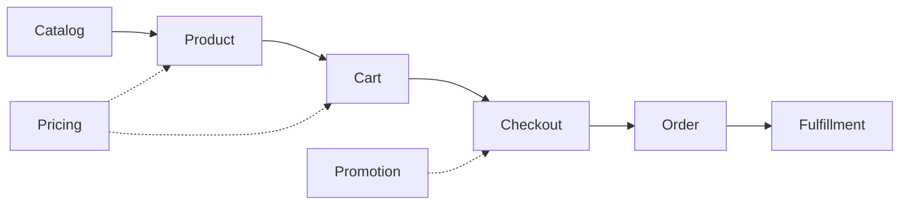

# Shop Engine — Library Specification (draft)

> Working title: **shop-engine** (name TBD). Status: draft spec, iterated alongside the
> Empires shop refactoring. Curated by Nayte (PO) — this document records the target,
> not the current state of any code.

## 1. Thesis

Every ordering system — an e-commerce site, a fast-food kiosk, a board-game shop, a B2B
procurement flow — follows the same canonical pattern:



Existing PHP solutions ship this pattern **welded to a commerce context**: Sylius assumes a
storefront (taxes, shipping, channels, admin), Thelia is a full CMS (own kernel, Propel,
MySQL schema). There is no *engine* — a minimal library that implements the pattern and
lets the host application decide everything contextual.

**shop-engine is that engine.** It models the ordering domain and nothing else. Every
contextual decision — how the cart is persisted, where products come from, who may
confirm an order, whether payment even exists — is a **port** the host implements (or a
shipped reference adapter it picks).

The founding insight, validated on a real project (Empires, a Mega Civilization
adaptation): a shop with no payment processing, no stock, no shipping and no taxes is
still, structurally, a shop. An order-taking system is the invariant core; commerce is
one possible context.

## 2. Design principles

1. **Minimal core, canonical vocabulary.** Types are named after the pattern
   (`Catalog`, `Product`, `Cart`, `Order`, `OrderLine`, `Promotion`) so any developer
   who has seen a shop understands the API in minutes. No invented jargon.
2. **Ports over features.** When a capability depends on context, the core defines an
   interface and ships nothing (or a trivial default). Reference adapters live in
   separate packages (`shop-engine/adapter-*`).
3. **Symfony components underneath, no framework required.** The core depends on
   standalone components only (see §6) and runs in any PHP app; a Symfony bundle is an
   *adapter*, not the core.
4. **CQRS-shaped write side.** Every domain mutation is an explicit command object with
   a handler. The read side is unconstrained.
5. **Data shapes are stable; statuses transition.** An `OrderLine` has the same shape
   whether the order is a draft, pending, or confirmed. The *authority* of a value
   (quoted vs frozen price) is carried by the order status, never by a change of shape.
6. **Nothing speculative.** The core ships the smallest surface that supports the known
   use cases (§8). Anything else is an extension point.

## 3. Domain model (core)

### Product & Catalog (read side)

- `ProductInterface` — **delivered**, minimal by PO decision: identity (`key`) plus
  the inputs pricing/promotion need — `cost` (int), `facets` (`list<string>`),
  `credits` (`array<string, int>`), `promotion` (`?ProductPromotion`). Deliberately
  **no display fields** (name, image, description): the library never renders
  anything, so it never needs them — the host rebuilds display rows from its own
  catalog (in Empires: `App\Game\Dto\Advance` implements it directly, zero
  accessors). The library never persists products.
- `ProductProviderInterface` (**port**) — **delivered**: `products()` and
  `productsByKeys(list<string> $keys)`, both returning `list<ProductInterface>`.
  Ordering is the provider's responsibility — callers must not re-sort. Adapters:
  Doctrine repository, config file (YAML/JSON), remote API, in-memory (in Empires:
  `App\Game\Shop\AdvanceProductProvider`, wrapping `AdvanceCatalog`).
- `CatalogInterface` — the *per-buyer* view of the products: the provider's output
  filtered by eligibility rules. Target, not yet built.
- `ProductEligibilityInterface` (**port**, chainable) — decides whether a buyer may see
  or buy a product. Reference rules: `NotAlreadyOwned`, `PrerequisitesMet`,
  `MaxQuantityPerBuyer`, `SegmentFilter` (e.g. region). Real-world source: game rules
  (one copy per player, tech prerequisites, region-restricted catalogs) map 1:1 to
  B2C rules (one per customer, bundle requirements, market segmentation). Target, not
  yet built.

### Buyer

- `BuyerInterface` — **delivered**: identity (`id`) plus the attributes pricing needs
  (`ownedKeys`, `electiveCredits`). The library never owns users; the host maps its
  User/Player/Customer entity onto this interface (in Empires:
  `App\Game\Shop\PlayerBuyer`, built by `ShopConnector::buyerFor()`). This is the
  primary connector to the host's world.

### Cart

- `Cart` — a **pure value object**: an ordered set of line intents (`key`, `quantity`).
  Operations: `add`, `remove`, `clear`, `has`, `isEmpty`, `fromKeys`. No storage, no
  services, no events. It is a *draft order* and nothing more.
- `CartStorageInterface` (**port**) — `load(buyerId): Cart`, `save(buyerId, Cart)`,
  `clear(buyerId)`. **This is the flagship example of the whole philosophy** — the same
  Cart serves radically different contexts purely by swapping storage:
    - `SessionCartStorage` — classic web session (default web adapter);
    - **client-held** — no storage at all: the UI layer holds the keys (hardware kiosk,
      Live Component prop, SPA state) and rebuilds `Cart::fromKeys()` per interaction;
      the library must work perfectly with a cart that only ever exists per-request;
    - `DoctrineCartStorage` — persistent carts (abandoned-cart recovery, cross-device);
    - `InMemoryCartStorage` — tests.

### Order & OrderLine

- `OrderLine` — immutable VO: `key`, `unitPrice`, `quantity` (+ extension slot for
  applied promotions, see §5). Same shape at every status. A line's price starts as a
  **quote** (snapshot at submission) and becomes **authoritative** when the order
  reaches a confirmed status.
- `OrderInterface` — identity, buyer ref, lines, total, status, timestamps. The host
  persists it (Doctrine mapping shipped as an adapter, with the lines as an embedded
  JSON document by default — a dedicated line table is the host's choice).
- **Status machine** — powered by `symfony/workflow`. Core default is deliberately
  tiny: `draft → pending → confirmed` + `cancelled` from any non-final state. Hosts
  extend the definition (paid, shipped, refunded…) without touching the engine; guards
  are workflow guards.
- `OrderNumberInterface`, `OrderRepositoryInterface` (**ports**) — identity scheme and
  persistence are contextual (sequential invoice numbers vs UUIDs vs `(buyer, turn)`
  uniqueness — all valid).

### Checkout (write side, CQRS)

Commands (final classes, validated by `symfony/validator`) and their handlers:

- `SubmitOrder { buyerId, lines, context }` — cart → pending order. The command
  receives its full payload; **handlers never read ambient state** (no session access
  from the domain — a lesson written in blood).
- `ConfirmOrder { orderId }` — freeze prices, fire fulfillment. Who may dispatch it is
  the host's concern: the buyer (self-checkout) or an operator (mediated checkout —
  POS, B2B approval). **Both are first-class**; the engine has no opinion.
- `CancelOrder { orderId, reason }` — explicit rejection with trace.
- `DirectSale { buyerId, lines, context }` — submit + confirm in one transaction (POS
  pattern).

Handlers are plain invokable services usable directly or through `symfony/messenger`
(sync or async — host's choice; the library does not require a bus).

### Fulfillment

- `FulfillmentInterface` (**port**) — what "delivering" means: granting a license,
  adding a game advance to a player, decrementing stock and printing a label, or
  nothing. Called on confirmation; must be reversible (`revoke`) to support
  cancellation of confirmed orders.

## 4. Pricing

- `PriceResolverInterface` (**port**) — `resolve(Product, Buyer): int`. Default: the
  product's base price. This is where *customer-specific pricing* plugs in (loyalty
  prices, owned-product credits, negotiated B2B rates).
- Invariants the engine enforces: prices are integers, floored at zero (a promotion
  can make a product free, never negative), line price × quantity = line total,
  order total = Σ line totals unless an order-level adjustment says otherwise.

## 5. Promotion engine

Rule → action, evaluated at cart display and re-evaluated (authoritatively) at
confirmation. Both sides are ports; the core ships the composition logic and a
reference action set distilled from real catalogs (96 products of a live game +
classic commerce):

| Action | Canonical name | Example |
|---|---|---|
| `Gift` | gift with purchase | "buying X grants one product of category C under price P for free" |
| `LineDiscount` | buy X get Y discount | "40 off one other line in the same order" |
| `ElectiveBenefit` | elective benefit (selectable earning rule) | "at purchase, the buyer allocates a standing pricing advantage" — the choice is persisted with the line (see below) |
| `PriceModifier` | customer-specific price | permanent reductions derived from owned products |

Rules (`RuleInterface`): order composition, buyer attributes, product category,
custom. Actions record themselves on the `OrderLine` extension slot — an order must
be able to explain its own total forever.

### Elective benefits (earn-only)

Real-world family: "choose your 5% cashback category" credit cards, "pick your
favorite brands" grocery programs — a purchase grants a **standing pricing
advantage whose shape the buyer configures at purchase time**.

**Earn-only, never burn.** Elective benefits are NOT loyalty points: points are a
currency (accumulated, then *spent* and decremented). Benefits apply to every
future eligible purchase, forever, and are never consumed. They live on the
*pricing* side (they feed `PriceResolverInterface` as buyer attributes aggregated
from confirmed order lines). A spendable balance would belong to the *payment*
extension instead — the earn/burn distinction is the boundary between the two.

**Facets are a port.** The engine never knows what the allocation facets *are*
(product categories, brands, departments, game colors…): the host connector
supplies the facet list, the engine validates **structurally** against the
benefit's configuration, the host's price resolver interprets the stored
allocations. Storing the choice on the order line keeps two invariants for free:
the order explains itself forever, and cancelling the order revokes the benefit.

**The shape of the choice is data, not code.** Configuration examples, both served
by the same engine and both observed in a real catalog:

```yaml
# free allocation: "distribute a budget across facets, in fixed steps"
benefit:
    budget: 20
    step: 5

# exclusive picks: "exactly N distinct facets at a fixed value each,
# with a conditional penalty on the facet left out"
benefit:
    pick: 4
    value: 10
    forfeit: 10   # applied to the remaining facet only if the buyer
                  # holds at least that much in previously earned benefits
```

The picker UI derives from the configuration (`budget`+`step` → a ±step
allocator; `pick` → "choose the excluded facet", a single interaction). A
`forfeit` may produce a *negative* entry in the stored allocation; aggregation is
a plain sum, so reversal and self-explanation still hold.

Out of core, possible as adapters: coupons/codes, time-boxed campaigns, cart-level
percentage discounts.

## 6. Symfony components used (and why)

| Component | Role | Required? |
|---|---|---|
| `symfony/workflow` | order status machine | yes |
| `symfony/validator` | command payload validation | yes |
| `symfony/uid` | identities | yes |
| `symfony/clock` | testable time (quotes, timestamps) | yes |
| `psr/event-dispatcher` | domain events — framework-agnostic path, for consumers without Messenger | **optional** — see §10 (Domain events) |
| `symfony/messenger` | command bus + dedicated event bus (`shop.event.bus`) — Symfony-native path, for both commands and domain events | **optional** — handlers are plain services either way |
| Doctrine ORM | order/cart persistence | **optional adapter** |
| Symfony bundle (DI config, session storage) | framework glue | **optional adapter** |

No Twig, no forms, no HTTP anything in core: the engine renders nothing.

## 7. What the core will NOT contain (anti-scope)

Payment processing, taxes, shipping, stock/inventory, multi-currency, admin UI,
user management, emails. Each is either a host concern or a future adapter. A shop
where payment happens "at the counter" (click-and-collect, game treasury, cash) is
the *default* mental model — payment is an extension, not a hole.

## 8. Reference use cases (agnosticism proof)

Each case = same core, different ports:

1. **Classic web shop** — session cart, Doctrine products, self-checkout, payment
   adapter, stock-decrement fulfillment.
2. **Fast-food kiosk** — client-held cart (the terminal owns the draft), catalog from
   API, `DirectSale` at the counter, no buyer accounts.
3. **Board-game shop (Empires)** — config-file catalog, eligibility = game rules
   (owned/prereqs/region), per-turn order uniqueness, operator-mediated confirmation
   (POS), fulfillment = granting advances, payment out of model, promotion actions
   gift/discount/option.
4. **B2B procurement** — persistent DB cart, approval workflow (extended status
   machine), negotiated `PriceResolver`, no promotions.
5. **Restaurant click-and-collect** — session cart, time-slotted context on
   `SubmitOrder`, pay at pickup.

## 9. Open questions (for iteration)

- Quantities: Empires never needs them (`quantity` fixed at 1) — core keeps the field
  from day one, or additive later? Leaning: field present, default 1, engine logic
  quantity-aware from the start (retrofitting is worse).
- Cart line richness: keys only, or key+quantity+options? Leaning: mirror `OrderLine`
  minus price.
- The `context` bag on commands (turn number, time slot, table number…): free array vs
  typed extension point.
- Package layout: monorepo with `core` + `adapter-doctrine` + `adapter-symfony` +
  `adapter-session`, split on release (Symfony-style)?
- License (MIT?), namespace, name.

## 10. Domain events

### Pourquoi

La lib `src/Shop/` doit pouvoir rester ignorante du code métier qui consomme ses commandes. Or brancher une réaction en fin de traitement (rafraîchir Mercure, écrire dans le flashbag, envoyer un mail…) demande un point d'extension : quelque chose qui se déclenche après qu'une commande a réussi, sans que la lib connaisse ses consommateurs.

### Deux mécanismes, pas un choix exclusif

On propose les deux chemins listés en §6, pour deux publics différents :

- **Bus Messenger dédié (`shop.event.bus`)** — le chemin natif pour un hôte Symfony. Ne coûte rien : Messenger est déjà une dépendance de la lib pour son architecture CQRS (bus de commandes). **Implémenté** (voir ci-dessous).
- **`psr/event-dispatcher`** — le chemin pour un consommateur véritablement extérieur à Symfony (pas de container Symfony, pas de Messenger). **Implémenté** (voir ci-dessous).

Question ouverte, à trancher plus tard une fois les deux en usage réel : est-ce que l'un finit par couvrir totalement l'autre (ex. un adapter PSR au-dessus du bus Messenger), ou est-ce que les deux valent la peine d'être maintenus en parallèle indéfiniment ? Pas de réponse pour l'instant.

### Deux canaux, un point d'entrée unique (implémenté)

Les deux canaux sont unifiés derrière `ShopEventPublisher`, une classe composée (Facade injectée, pas un trait ni une classe de base héritée) que chaque `CommandHandler` reçoit comme n'importe quelle autre dépendance :

```php
final readonly class ShopEventPublisher
{
    public function __construct(
        private EventDispatcherInterface $eventDispatcher,
        #[Autowire(service: 'shop.event.bus')]
        private MessageBusInterface $eventBus,
        private LoggerInterface $logger,
    ) {}

    public function publish(object $event): void
    {
        // dispatch sur les deux canaux, chacun isolé par son propre try/catch
    }
}
```

Le connecteur se branche par le canal de son choix, les deux reçoivent le même event :

```php
// Canal Messenger
#[AsMessageHandler(bus: 'shop.event.bus')]
final class OnOrderSold { public function __invoke(OrderSold $event): void { /* ... */ } }

// Canal PSR-14
#[AsEventListener]
final class OnOrderSoldSync { public function __invoke(OrderSold $event): void { /* ... */ } }
```

`publish()` isole chaque canal dans son propre try/catch et journalise l'exception plutôt que de la laisser remonter : dans les 4 `CommandHandler`, le dispatch a lieu **après** que l'état a été durablement persisté (flush/validate déjà passés). Un listener qui lève une exception ne doit pas transformer une commande réellement réussie en échec apparent pour l'appelant — d'où l'isolation + log, jamais un swallow silencieux.

### Mécanisme Messenger (implémenté)

Un second bus Messenger, dédié aux events métier, coexiste avec le bus de commandes :

```yaml
# config/packages/messenger.yaml
framework:
    messenger:
        default_bus: messenger.bus.default
        buses:
            messenger.bus.default: ~
            shop.event.bus:
                default_middleware:
                    allow_no_handlers: true   # aucun listener n'existe encore côté connecteur
```

Contrairement au bus de commandes (un seul handler autorisé par message), un bus d'events accepte N souscripteurs indépendants — c'est le rôle de `allow_no_handlers` que d'autoriser aussi zéro souscripteur, l'état actuel.

Chaque `CommandHandler` de `src/Shop/CommandHandler/` dispatch, une fois son traitement effectivement réussi (jamais avant), un event immuable au payload scalaire (pas d'entité Doctrine — le rend sérialisable si le bus passe un jour en async) :

| Command       | Event            | Payload               | Condition d'émission                          |
|---------------|------------------|-----------------------|-----------------------------------------------|
| `SubmitOrder` | `OrderSubmitted` | `playerId`, `window`  | toujours                                      |
| `RejectOrder` | `OrderRejected`  | `playerId`, `window`  | toujours                                      |
| `SellDirect`  | `OrderSold`      | `playerId`, `window`  | toujours                                      |
| `EraseOrders` | `OrdersErased`   | `playerId`, `windows` | uniquement les fenêtres réellement supprimées |

Pour se brancher, le connecteur enregistre un handler sur ce bus :

```php
#[AsMessageHandler(bus: 'shop.event.bus')]
final class OnOrderSold
{
    public function __invoke(OrderSold $event): void { /* Mercure, mail, flashbag... */ }
}
```

### Alternatives écartées

- **Décorer le `CommandHandler`** — couple le connecteur à l'implémentation interne du handler (fragile si la lib change), et scale mal dès qu'on veut plusieurs listeners indépendants.
- **`WorkerMessageHandledEvent`** (event natif du `Worker` Messenger) — ne se déclenche que via `messenger:consume` sur un transport réellement async ; inopérant tant que nos commandes restent en `sync://`.

### Ce qui n'est pas (encore) fait

Les `hub->publish(...)` existants restent en dur dans les handlers et dans `OrderValidator` — ils ne sont pas migrés vers des listeners du nouveau bus. C'est la base seulement ; la suite naturelle est F2-④ (port événements, voir tableau des chantiers dans `shop.md`).

### Point de vigilance

Le state machine `shop_order` (`config/packages/workflow.yaml`) émet déjà nativement, via l'EventDispatcher standard, des events Symfony Workflow sur ses transitions (`workflow.shop_order.completed.validate`, `.reject`, `.resubmit`). `OrderSold` et `OrderRejected` — ainsi qu'`OrderSubmitted` dans le cas `resubmit` — font donc doublon avec un signal déjà disponible sans code supplémentaire. Seul `OrdersErased` est réellement inédit (l'effacement ne passe pas par la state machine). À trancher : garder `shop.event.bus` comme point d'entrée unique et uniforme pour tout le métier, ou s'appuyer sur les events Workflow pour tout ce qui est une transition d'état et réserver `shop.event.bus` aux actions qui n'en sont pas.
